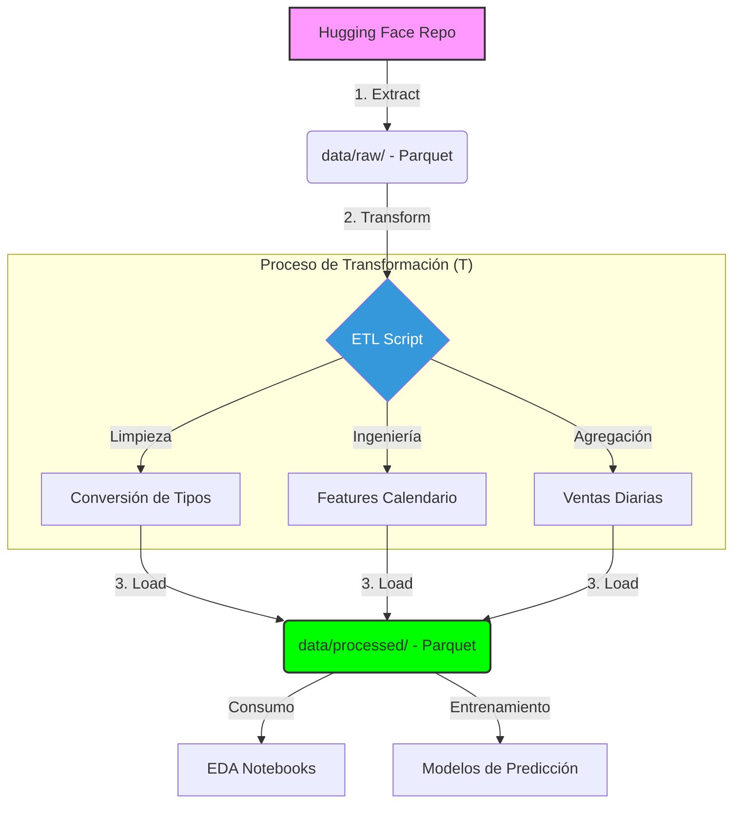
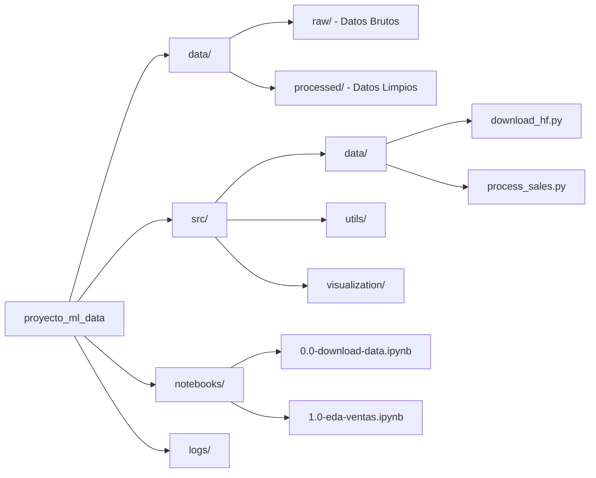

# Proyecto de ML: Store Sales Time Series Forecasting

Este proyecto implementa un pipeline profesional de Ciencia de Datos para el análisis y predicción de ventas, utilizando datos de **Hugging Face** y una arquitectura modular de **ETL (Extract, Transform, Load)**.

---

## 📊 Arquitectura y Flujo de Datos

A continuación se muestra cómo fluyen los datos a través del sistema:



## 🧼 Calidad de Datos e Imputación

El pipeline de transformación aplica técnicas avanzadas para asegurar la integridad de las series temporales:

- **Imputación por Constante (Cero):** Aplicado a la columna `onpromotion`. Si no existe el registro, se asume la ausencia de ofertas.
- **Interpolación Lineal:** Se utiliza para completar huecos de hasta 3 días en la serie de ventas, manteniendo la tendencia local.
- **Forward Fill (ffill):** Para huecos mayores o finales, se utiliza el último valor conocido para evitar rupturas en la serie.
- **Imputación Agrupada:** Todo el proceso se realiza de forma independiente por **Tienda** y **Familia de Producto**, evitando la contaminación de tendencias entre diferentes categorías.

---

## 🚀 Estructura del Proyecto

La organización del código sigue los estándares de la industria para proyectos de Machine Learning:



---

## 🛠️ Cómo empezar

### 1. Entorno Virtual y Dependencias (usando `uv`)
Este proyecto utiliza **`uv`** para una gestión de paquetes ultra-rápida. 

- **Activar entorno:**
  ```powershell
  .\.venv\Scripts\activate
  ```
- **Instalar dependencias:**
  ```powershell
  uv pip install -r requirements.txt
  ```

*Nota: `uv` es hasta 100x más rápido que `pip`. Si no lo tienes instalado, puedes instalarlo con `pip install uv`.*

### 2. Ejecución del Pipeline
El proyecto está diseñado para ejecutarse de forma secuencial:

1.  **Descarga (Extract):**
    ```powershell
    python src/data/download_hf_dataset.py
    ```
2.  **Procesamiento (Transform & Load):**
    ```powershell
    python src/data/process_sales.py
    ```
3.  **Visualización:**
    ```powershell
    python src/visualization/generate_reports.py
    ```

## 📝 Monitoreo y Logging
El sistema utiliza un logger centralizado que registra cada paso del proceso en la carpeta `logs/`. Esto permite auditar la salud del pipeline y detectar errores en la transformación de los datos de forma temprana.

---
*Desarrollado como un entorno profesional de Machine Learning con soporte para diagramas Mermaid.*
